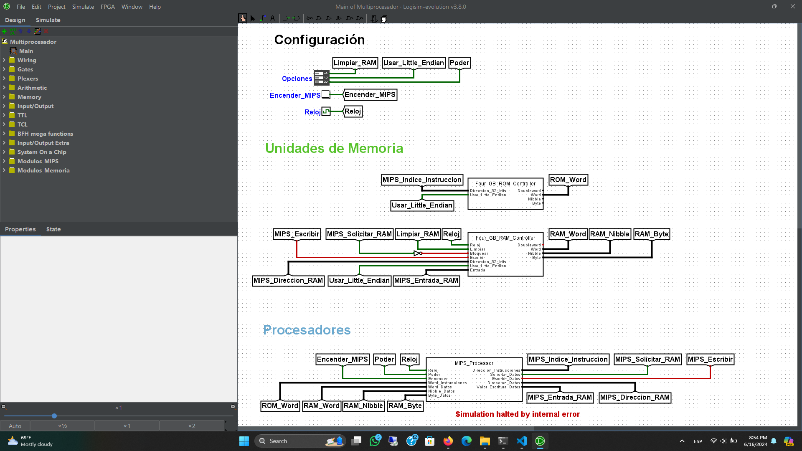
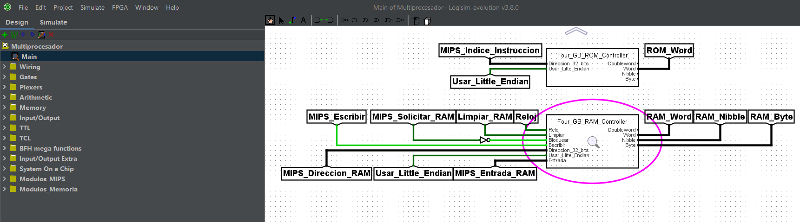
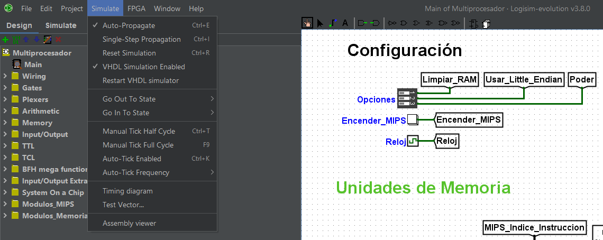
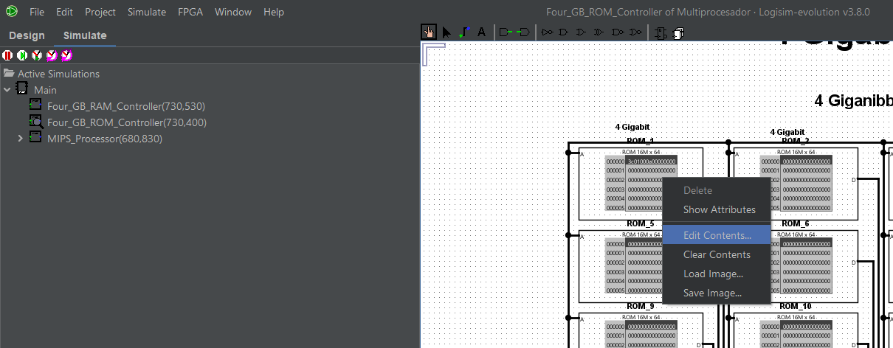
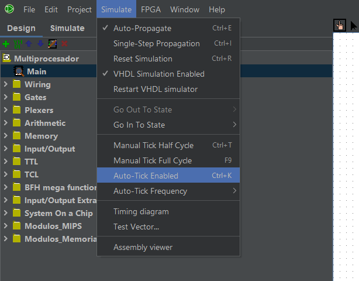
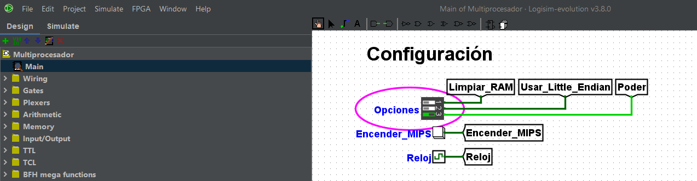
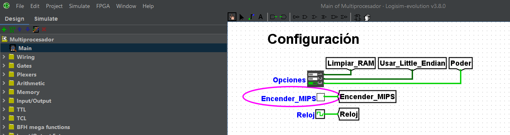
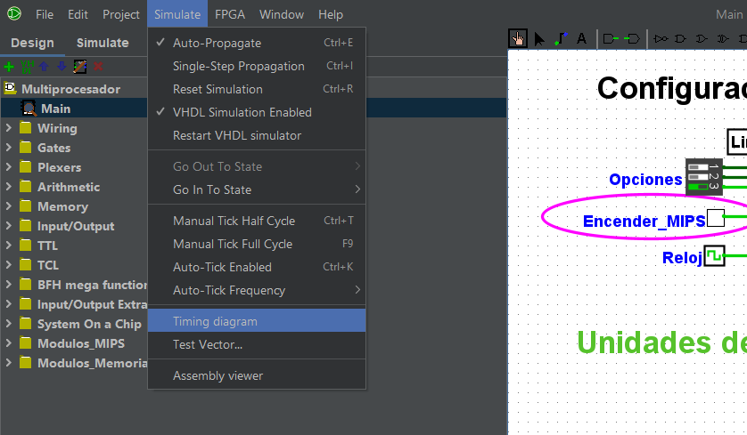
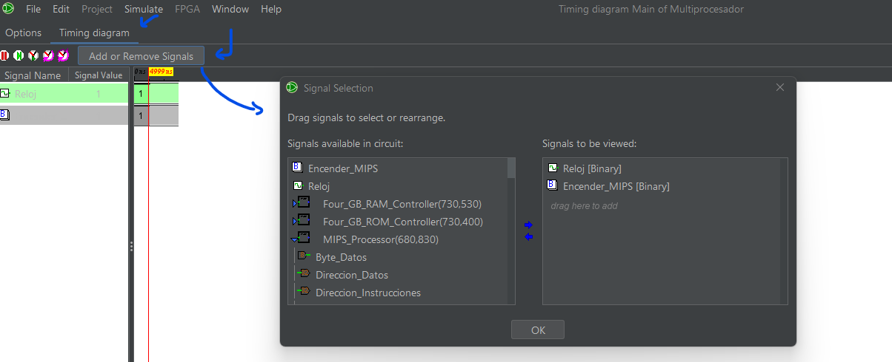
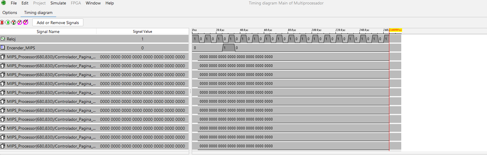

# 📟 Multiprocesador Gráfico

Simulación de arquitectura multi-procesador para procesamiento gráfico de imágenes desarrollado para el curso de Arquitectura de la carrera de Computación de Varios Énfasis de la Universidad de Costa Rica, impartido durante el primer semestre de 2024.

## 🔎 Acerca del proyecto

Éste proyecto consiste en una simulación de un multi-procesador y componentes digitales de memoria y visualización correspondientes para el procesamiento gráfico de imágenes. A grandes razgos, la arquitectura consiste de:
- [Procesador MIPS-I32](./MIPS/README.md) (como procesador principal de propósito general)
- Co-procesadores RISC-V (especializados en procesamiento de imágenes)
- [Memoria Caché](./Cache/README.md) (de múltiples niveles)

### 📋 Pre-requisitos

Para ejecutar esta simulación usted requiere del siguiente software: 
- [Logisim Evolution](https://github.com/logisim-evolution/logisim-evolution) (v.3.8.0)
- [ModelSim FPGA Version](https://www.intel.com/content/www/us/en/software-kit/750666/modelsim-intel-fpgas-standard-edition-software-version-20-1-1.html) (v.20.1.1)

Adicionalmente, se require de cierta familiaridad previa con la versión correspondiente del software de simulación de `Logisim Evolution`.

### 🎬 Ejecución del proyecto

Para ejecutar la simulación del proyecto, siga los siguientes pasos:
1. Clone el repositorio localmente en su máquina
2. Ejecute el ambiente de simulación de `Logisim Evolution` y abra el archivo de circuito digital encontrado bajo [`/MIPS/Multiprocesador.circ`](./MIPS/Multiprocesador.circ). 

> Debería obtener una vista semejante a la siguiente:

3. Asegúrese de que éste circuito digital y sus dependencias (bibliotecas de `Logisim Evolution`) se encuentren correctamente cargadas. Para más información, puede leer [la documentación correspondiente de `Logisim Evolution`](https://github.com/logisim-evolution/logisim-evolution/blob/main/docs/docs.md)
4. Una vez en la simulación, asegúrese de que la simulación de VHDL estén habilitada. De no estarlo, habilítela (`VHDL simulation enabled`) y aplique la opción de Reiniciar simulación (`Reset simulation`).

> Debería poder observar las opciones de habilitarlas bajo el menú rápido de `Logisim Evolution` de la siguiente manera:

5. Una vez habilitada la simulación de VHDL, navegue al interior del subcircuito de ROM (`Four_GB_ROM_Controller`).

> Debería poder accesar al subcircuito presionando click izquierdo sobre el subcircuito rotulado de la siguiente forma:

6. Una vez adentro, puede editar los contenidos de los módulos de memoria para escribir su programa. Se encuentran dispuestos de izquierda a derecha, de arriba hacia abajo, en direccionamiento de 32 bits Big Endian para palabras de 32 bits escritas en Little Endian (de derecha a izquierda también). 

> Aplique la opción de editar los contenido del primer módulo de memoria (de izquierda a derecha, de arriba hacia abajo) para escribir las primeras instrucciones del programa a leer por el procesador de propósito general, y así para el resto de su programa. 

> Debería poder observar la opción de editar contenidos de la memoria al presionar click derecho sobre el componente de `Logisim Evolution` descrito anteriormente:

> Alternativamente, puede cargar un archivo de su computadora representando las instrucciones a cada módulo de memoria correspondiente mediante los otros mecanismos que ofrece `Logisim Evolution`.

7. Una vez que haya terminado de escribir su programa, navegue de vuelta al circuito principal y habilite la opción de activación automática de reloj (`Auto-tick Enabled`)

> Debería poder observar la opción de habilitarlo de la siguiente manera:

> Puede cambiar la frecuencia del reloj y otros aspectos mediante mecanismos que ofrece `Logisim Evolution`.

8. Ahora, habilite en el interruptor correspondiente, presente en el circuito principal, la opción de `Poder` para "brindar poder" al procesador. 

> Debería poder activar el interruptor de `Poder` de la siguiente forma:

9. Tras haberlo hecho, presione con el click izquierdo el botón de `Encender_MIPS` correspondiente para "prender" el procesador principal MIPS. Manténgalo presionado durante un ciclo únicamente.

> Debería poder presionar el botón de `Encender_MIPS` de la siguiente forma:

10. De haber seguido las instrucciones, el procesador principal de MIPS-I32 se debería encontrar corriendo en la simulación. Si desea detener la simulación, detenga el reloj de la simulación deshabilitando la opción de activación automática de reloj (`Auto-tick Enabled`) o el interruptor de `Poder`, o ambas cosas.

11. Si desea observar los efectos de la ejecución de instrucciones del procesador sobre los registros de éste a traves del tiempo, los puede visualizar un diagrama de tiempo provisto por `Logisim Evolution` bajo la opción correspondiente (`Timing diagram...`).

> Debería poder accesar al menú de diagrama de tiempo de la siguiente forma:

> Una vez adentro, puede añadir las señales que desea observar en el diagrama de tiempo como se muestra a continuación. Puede encontrar más información refiriéndose a la [la documentación correspondiente de `Logisim Evolution`](https://github.com/logisim-evolution/logisim-evolution/blob/main/docs/docs.md):

> Por último, puede observar los efectos en las señales añadidas a través del tiempo mediante el diagrama como se muestra en el ejemplo a continuación, donde se observan los valores de la página de registros del procesador MIPS tras un par de ciclos de reloj:

## 🚧 Ejecución de las pruebas

TODO @GabrielMBulgarelli

## 👩🏻‍💻 Estado del proyecto

El proyecto actualmente se encuentra en desarrollo, con la versión actual presentando el procesador de propósito general y la caché de memoria, pero sin la unión entre ambos. Se planea desarrollar esto a futuro.

Para más información acerca de los distintos módulos de la aplicación, referirse a la documentación correspondiente, presente en las carpetas de [MIPS](./MIPS/) y [Caché](./Cache/)

## 🤝🏻 Créditos

- **Javier Solano** - *Desarollo del procesador MIPS de propósito general* - [suehtemorp](https://github.com/suehtemorp)

- **Lucía Elizondo** - *Desarollo de la memoria caché* - [lesan2807](https://github.com/lesan2807)

- **Gabriel Bulgarelli** - *Apoyo en caché y pruebas de ejecución* - [GabrielMBulgarelli](https://github.com/GabrielMBulgarelli)
